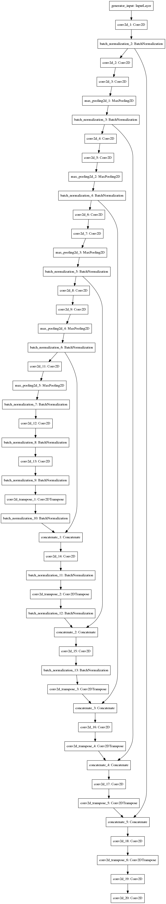
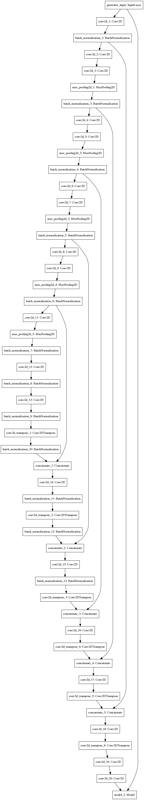
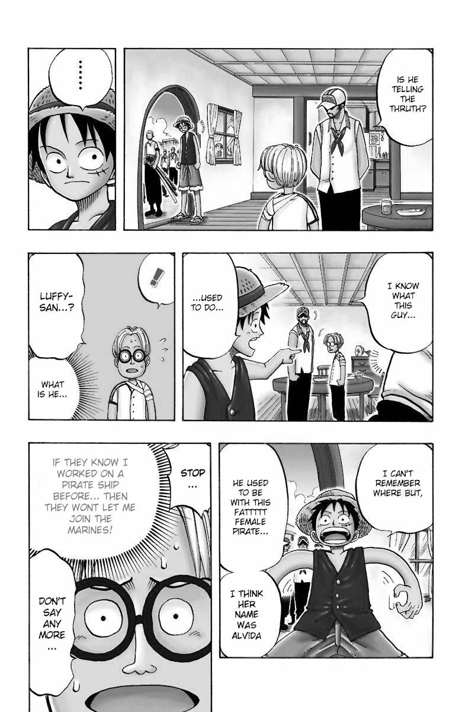

# Manga Colorization
  - **`models/`** consists the cGAN models & visualizations.
  	- run **`train.py`** to train on images stored in **`datasets/train`**.
  	- run **`test.py`** to generate colorization for images in **`datasets/test`**.
  	- **`datasets/generated_Images`** contains generated images and trained model weights.
  	- **`datasets/test`** contains testing images.
  	- **`datasets/train`** contains/put dataset for training.
  	- **`datasets/validation`** contains validation set of images for training.
	
  - **Segmentation and post-processing**
  	- **`segmentation/input_images`** contains test images
  	- **`segmentation/bw_images`** contains the black and white images after screentone removal
	- **`Results`** contains results for postprocessing and final outputs  	
  	- run **`segmentation.m`** in **MATLAB** to segment the input image (Monochrome Original)
	
  - **cGAN**
	 +  = 

    
